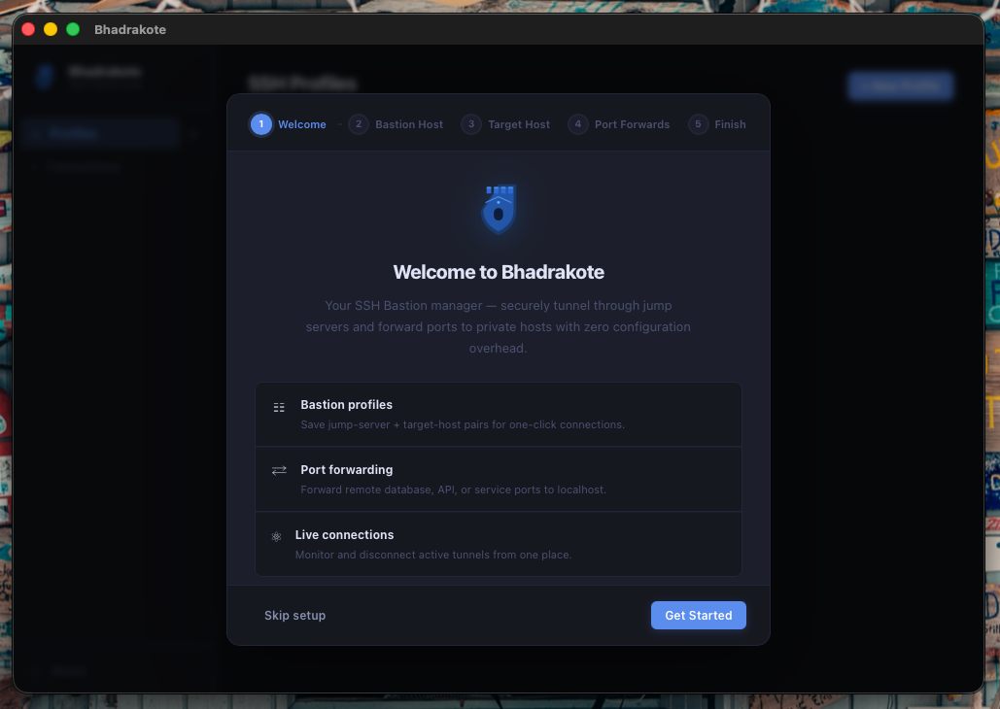
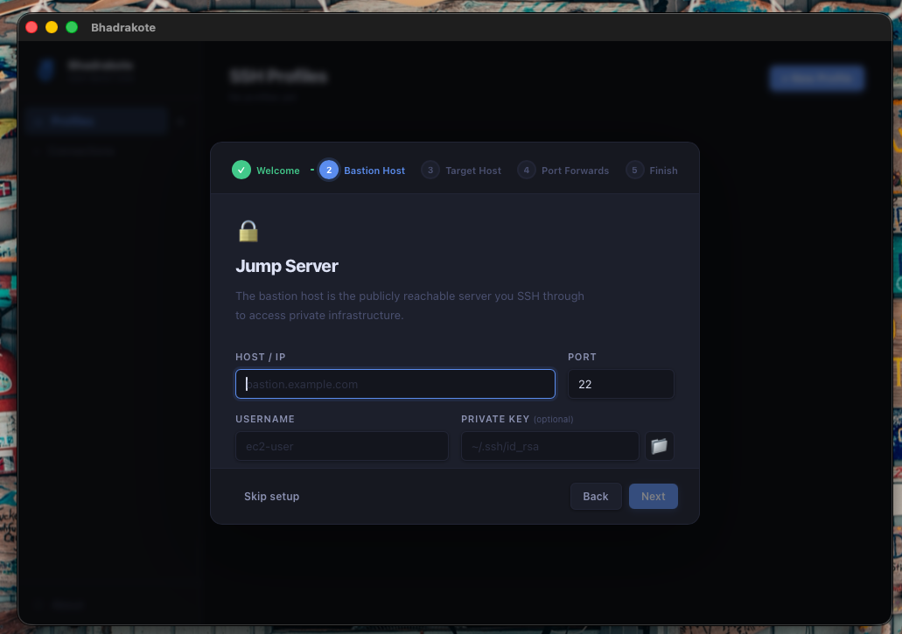
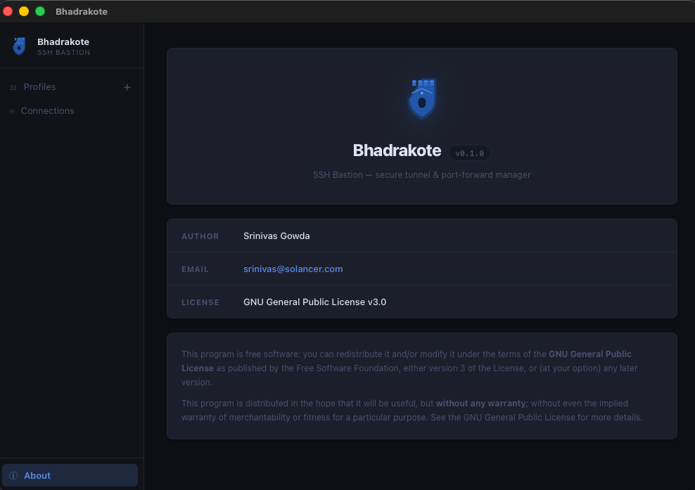

# Bhadrakote

An SSH tunnel manager built with Tauri, React, and TypeScript. Create and manage SSH port-forwarding profiles with bastion/jump-host support.

## Screenshots

| Setup Wizard | Bastion Host Config | About |
|:---:|:---:|:---:|
|  |  |  |

## Development

```bash
# Install dependencies
npm install

# Start the dev server + Tauri window
npm run tauri dev
```

## Building

```bash
# Build the frontend and compile the Tauri app for your current platform
npm run tauri build
```

Build artifacts are written to `src-tauri/target/release/bundle/`:

| Platform | Artifacts |
|----------|-----------|
| macOS    | `.dmg`, `.app` |
| Windows  | `.msi`, `.exe` (NSIS) |
| Linux    | `.deb`, `.AppImage`, `.snap` |

## Creating a GitHub Release

This repo includes a GitHub Actions workflow at `.github/workflows/release.yml`. To cut a release:

1. Update the version in **both** `package.json` and `src-tauri/tauri.conf.json`.
2. Push a tag matching the version:
   ```bash
   git tag v0.1.0
   git push origin v0.1.0
   ```
3. The workflow builds on macOS, Windows, and Ubuntu (including a Snap package), then publishes a GitHub Release with all platform binaries attached.

You can also trigger the workflow manually from the **Actions** tab using the "Run workflow" button.

## Recommended IDE Setup

- [VS Code](https://code.visualstudio.com/) + [Tauri](https://marketplace.visualstudio.com/items?itemName=tauri-apps.tauri-vscode) + [rust-analyzer](https://marketplace.visualstudio.com/items?itemName=rust-lang.rust-analyzer)

## License

[GPL-3.0](LICENSE)
